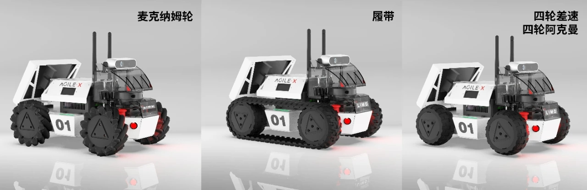

# Disclaimer
This is a copy of original LIMO_ROS repository that includes a simplified gazebo-simulated LIMO package.
Original LIMO gazebo simulation package can be found at https://github.com/agilexrobotics/limo_ros.git.
Notice that joystick support for LIMO robot is not available in this repository.

# limo_ros
This repository contains ROS packages for limo. 

 

## Packages


* limo_base: ROS wrapper for limo
* limo_bringup: launch and configuration files to start ROS nodes
* limo_description: URDF model for limo 

## Build from source code
Clone the repository and catkin_make:
```
    $ cd ~/catkin_ws/src
    $ git clone https://github.com/agilexrobotics/limo_ros.git
    $ cd ..
    $ catkin_make
```


## Usage

* Start the base node for limo

    ```
    $ roslaunch limo_bringup limo_start.launch
    ```


* Start the keyboard teleop node

    ```
    $ roslaunch limo_bringup limo_teleop_keyboard.launch
    ```

    
